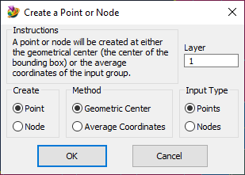
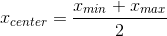
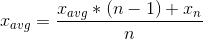

# Create-Node-or-Point-at-Center
Creates a node or a point at either the geometric center or the average coordinates of a selection of nodes or points

See also: [How to use Femap Scripts](https://github.com/aaronjasso/How_to_use_Femap_Scripts) and [The List of my Femap Scripts](https://github.com/aaronjasso/My-Femap-Scripts)

---

This program is fairly straightforward. The options are described below.

### 1. Create
   * __Point__
   
   The program will create a point
   
   * __Node__
   
   The program will create a node
   
### 2. Method
* __Geometric Center__
	
The new point or node will be located at the center of the bounding box. Mathematically, the X coordinate is found using the equation
  

  
Where `Xmin` is the least x-coordinate of all entities selected, and `Xmax` is the greatest x-coordinate of all entities selected. The y- and z-coordinates are found in the same way.
	
* __Average Coordinates__
	
The new point or node will be located at the average coordinates of all selected entities. The average is found by iterating through the selected entities using the equation
  

 
Where `Xavg` is the running average x-coordinate, `n` is the iteration (1 to the number of entities being averaged), and `Xn` is the Nth x-coordinate of the selection.
	
Note that this is the method used by Femap when making a new RBE2 or RBE3 and selecting the option "New Node At Center."

### 3. Input Type
* __Points__
	
You will be prompted to select points to average.
	
* __Nodes__
	
You will be prompted to select nodes to average.

---

Equation images made with [CodeCogs Equation Editor](http://latex.codecogs.com/).
